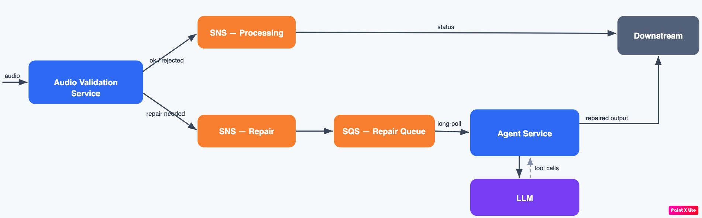

# Audio Repair Agent



A production-style **agentic workflow that recovers corrupted audio/video files
`ffmpeg` can't decode straight off.** It validates and classifies an incoming
file, tries a deterministic fast-path (stream-copy remux) first, and only then
escalates to a **constrained LLM agent** that emits typed, allow-listed tool
calls — never a shell — fenced by hard iteration / tool-call / token /
wall-clock budgets, with an objective verify gate (decodes cleanly **and** still
has audio).

The LLM backend is pluggable via any OpenAI-compatible endpoint: a small,
CPU-runnable Qwen on **Ollama** for local dev, **vLLM** on GPU in production —
no code change, only environment variables.

---


- **Deterministic-first.** A cheap, predictable remux handles the common cases;
  the (slower, costlier) LLM agent only runs on the genuine residual.
- **The model can't hurt you.** The agent only emits typed tool calls validated
  by a registry (`pydantic`, `extra="forbid"`); each becomes vetted `ffmpeg`
  argv. No shell, ever. A per-job sandbox guards against path escape.
- **Bounded cost.** Every agent loop is fenced by four independent budgets plus
  no-progress detection, and every termination is a logged `stop_reason`.
- **Objective success.** "Repaired" means the output actually decodes and
  contains audio — not "the model said so".
- **Operable.** Structured single-line JSON logs with correlation ids; the
  worker never throws (a poisoned message becomes a report, not a crash).

## How it works

```
audio → Audio Validation Service → SNS(processing)  → Downstream        (ok / rejected)
                                  └ SNS(repair) → SQS → Agent Service → Downstream (repaired)
                                                          └ ⇄ LLM (constrained tool calls)
```


## Project layout

```
src/audio_repair/
  core/        config, ffmpeg wrappers, s3/sns, sandbox, taxonomy, telemetry
  intake/      validate · classify · route (the Audio Validation Service)
  repair/      worker · fastpath · agent · tools · verify (the Agent Service)
  llm/         OpenAI-compatible client (Ollama dev / vLLM prod)
  eval/        corruptors · harness · metrics · scorecard
  service.py   long-polling SQS consumer (ECS runtime)
  cli.py       `audio-repair` entrypoint
infra/         Terraform: ECR, SNS, SQS+DLQ, ECS Fargate, IAM (GitHub OIDC), autoscaling
.github/workflows/  ci.yml (test) · deploy.yml (build → push → ECS)
```

## Quickstart

```bash
# Prereqs: Python 3.12, ffmpeg/ffprobe on PATH (brew install ffmpeg)
make venv          # .venv + install package + dev deps

# Local LLM (small Qwen on CPU via Ollama's OpenAI-compatible API)
ollama pull qwen2.5:3b-instruct
export LLM_BASE_URL=http://localhost:11434/v1
export LLM_MODEL=qwen2.5:3b-instruct

make test          # full offline suite (LLM mocked) — deterministic
```

## CLI

```bash
audio-repair intake --s3 s3://bucket/clip.mp4      # validate + route a file
audio-repair repair --s3 s3://bucket/broken.mp4    # run the repair pipeline
audio-repair eval   --seed-dir ./seeds --out-dir ./eval_out   # scorecard
audio-repair serve  --mode agent                   # long-poll SQS (ECS service)
```

## Configuration

All configuration is environment-driven; nothing sensitive is hardcoded.

| Variable | Meaning | Default |
| --- | --- | --- |
| `LLM_BASE_URL` | OpenAI-compatible endpoint | _required to use the agent_ |
| `LLM_MODEL` | served model id | _required to use the agent_ |
| `LLM_API_KEY` | backend key (Ollama ignores it) | unset |
| `AWS_REGION` | AWS region | `us-east-1` |
| `S3_OUTPUT_BUCKET` | repaired files + reports | _(empty)_ |
| `PROCESSING_TOPIC_ARN` / `REPAIR_TOPIC_ARN` | SNS hand-off topics | _(empty)_ |
| `SQS_QUEUE_URL` | queue for `serve` | _(empty)_ |
| `AGENT_MAX_ITERATIONS` / `AGENT_TOKEN_BUDGET` / `AGENT_WALL_CLOCK_TIMEOUT_S` | agent safety fences | `20` / `8192` / `120` |
| `MAX_DURATION_S` | length-gate rejection (≥) | `10800` (3h) |

The LLM backend (`LLM_*`) is read directly from the environment by `LLMClient`;
the rest flow through `Settings` (`core/config.py`). Unset/empty variables fall
back to defaults rather than clobbering them.

## Testing

```bash
make test          # 136 tests, fully offline (LLM + AWS mocked via moto)
make cov           # with coverage
```

The suite never touches the network or a live LLM. The single integration test
hits a live LLM only when `RUN_LLM_INTEGRATION=1`.

## Deployment (AWS)

Container + ECS Fargate, provisioned by Terraform, shipped by GitHub Actions.

```bash
# 1. Provision infra (ECR, SNS, SQS+DLQ, ECS, IAM incl. GitHub OIDC role)
cd infra
terraform init
terraform apply \
  -var vpc_id=vpc-... -var 'private_subnet_ids=["subnet-...","subnet-..."]' \
  -var github_owner_repo=<owner>/<repo> \
  -var llm_base_url=http://vllm.internal/v1 -var llm_model=<model> \
  -var llm_api_key_secret_arn=arn:aws:secretsmanager:...
```

Then set the Terraform outputs as GitHub **repo variables** (`ECR_REPOSITORY`,
`ECS_CLUSTER`, `ECS_SERVICE_AGENT`, `ECS_TASK_FAMILY_AGENT`, `AWS_REGION`) and
the deploy role as the **secret** `AWS_DEPLOY_ROLE_ARN`. Pushing to `main` then:

1. **`ci.yml`** runs the test suite.
2. **`deploy.yml`** assumes the OIDC role → builds the image → pushes to ECR →
   renders the live task definition with the new image → rolls out the ECS
   service and waits for stability.

## Design notes

- **Corruption taxonomy** — 26 cases across 4 tiers (`core/taxonomy.py`) drive
  classification and the fail-fast policy.
- **Eval harness** — synthesizes known corruptions, runs the full pipeline, and
  emits a scorecard (success rate, fast-path rate, correct-giveup rate, p95).

